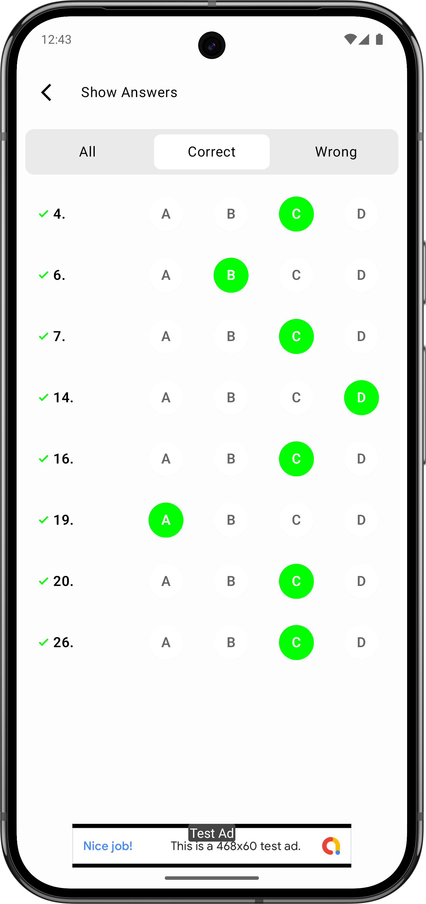
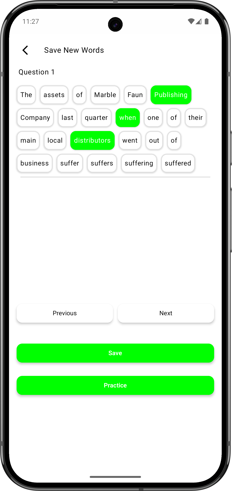
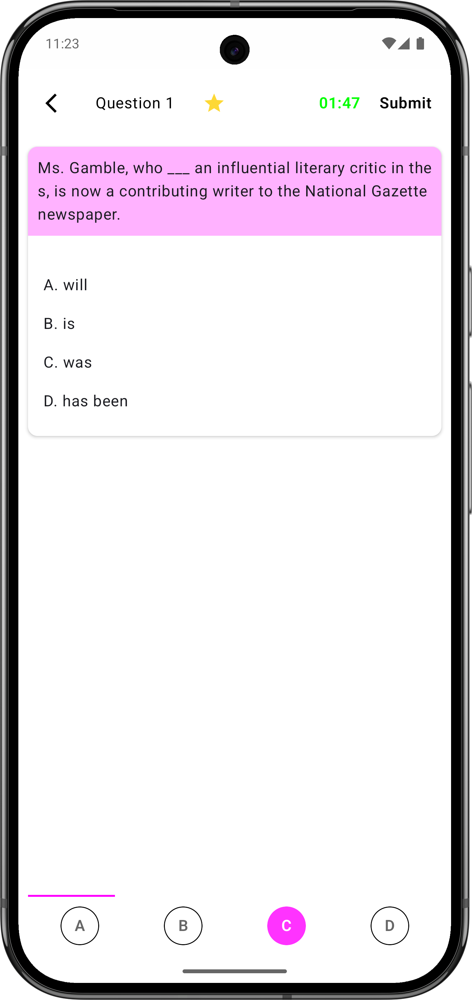
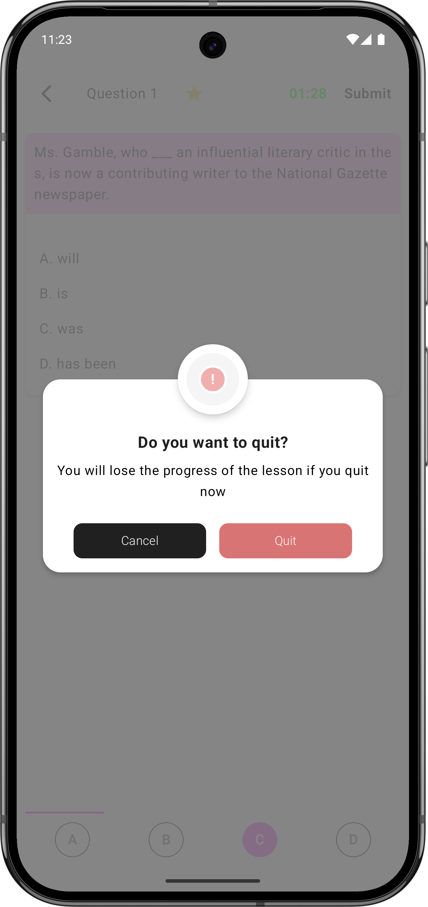
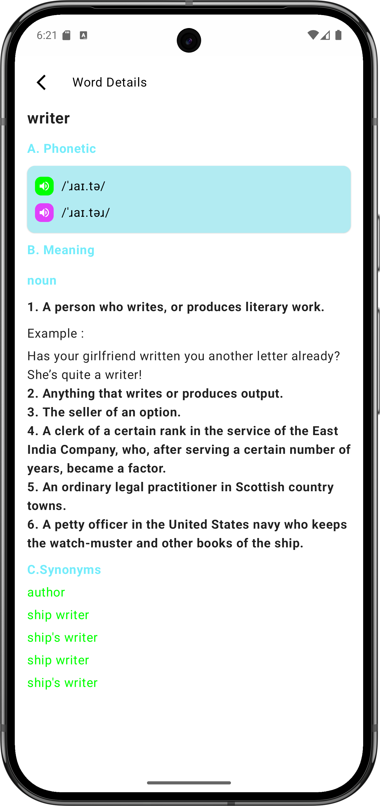

# 📘 TOEIC Part 5 Practice App – Android

Ứng dụng Android hỗ trợ luyện tập **TOEIC Part 5**, cung cấp chế độ **học – thi mô phỏng**, kết hợp **học từ vựng qua flashcards**, **mini-games** và **thống kê tiến độ chi tiết** giúp người học cải thiện điểm số hiệu quả.

Ứng dụng được phát triển bằng **Kotlin**, sử dụng **Jetpack Compose** và kiến trúc **MVVM + Clean Architecture**.

---

## 📱 Screenshots

<p>
  
  
  
  
  
  
  
  
  
  
  
  
  
</p>

---

## 🚀 Features

### 📝 TOEIC Part 5 Practice
- **Study Mode**: học từng câu, có gợi ý và giải thích chi tiết  
- **Exam Mode**: thi mô phỏng giống đề thật  
- Chấm điểm rõ ràng: đúng / sai kèm lời giải

### 📚 Vocabulary Learning
- Flashcards tương tác
- Mini-games hỗ trợ ghi nhớ từ vựng
- Lưu và quản lý từ vựng đã học

### 📊 Progress Tracking
- Thống kê trực quan bằng **Vico Chart**
- Theo dõi độ chính xác, lịch sử làm bài và tiến độ học

### ⏰ Daily Reminders
- Nhắc nhở học tập hằng ngày
- Sử dụng:
  - **AlarmManager** cho nhắc nhở chính xác
  - **WorkManager** cho tác vụ nền ổn định

### 💰 AdMob Integration
- Tích hợp **Google AdMob**

---

## 🧱 Tech Stack

- **Language:** Kotlin  
- **UI:** Jetpack Compose  
- **Architecture:** MVVM + Clean Architecture  
- **Dependency Injection:** Hilt  
- **Local Database:** Room  
- **Networking:** Retrofit  

**Background Tasks**
- AlarmManager  
- WorkManager  

**Others**
- Charts: Vico Chart  
- Ads: Google AdMob  

---

## 🛠️ Setup & Run

1. Clone repository:
   ```bash
   git clone https://github.com/Hoamz123/MewToeic
